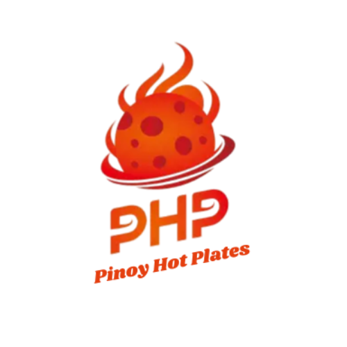

<a name="readme-top">

<br/>

<br />
<div align="center">
  <a href="https://github.com/MarkGamboaa">
  <!-- TODO: If you want to add logo or banner you can add it here -->
    
  </a>
<!-- TODO: Change Title to the name of the title of your Project -->
  <h3 align="center">(PHP) Pinoy Hot Plates</h3>
</div>
<!-- TODO: Make a short description -->
<div align="center">
  A simple Filipino restaurant website made with PHP
</div>

<br />

<!-- TODO: Change the zyx-0314 into your github username  -->
<!-- TODO: Change the WD-Template-Project into the same name of your folder -->


[](https://wakatime.com/badge/user/ecc143bc-1d49-4389-8363-3bdffc20725e/project/cf7388dd-5413-4688-bbc4-5ea5fc6c1304)

---

<br />
<br />

<!-- TODO: If you want to add more layers for your readme -->
<details>
  <summary>Table of Contents</summary>
  <ol>
    <li>
      <a href="#overview">Overview</a>
      <ol>
        <li>
          <a href="#key-components">Key Components</a>
        </li>
        <li>
          <a href="#technology">Technology</a>
        </li>
      </ol>
    </li>
    <li>
      <a href="#rule,-practices-and-principles">Rules, Practices and Principles</a>
    </li>
    <li>
      <a href="#resources">Resources</a>
    </li>
  </ol>
</details>

---

## Overview

<!-- TODO: To be changed -->
<!-- The following are just sample -->

PHP (Pinoy Hot Plates) is a simple PHP-based website designed to showcase classic Filipino meals throughout the day. It includes dedicated pages for Breakfast, Lunch, and Dinner, allowing users to browse delicious Pinoy dishes in an organized and visually appealing format.

### Key Components

<!-- TODO: List of Key Components -->
<!-- The following are just sample -->

- Simple and intuitive navigation layout
- Organized file structure for better readability and scalability

### Technology

<!-- TODO: List of Technology Used -->

#### Language


#### Framework/Library


<!-- Do not Change this -->

1. Always use `AD-` in the front of the Title of the Project for the Subject followed by your custom naming.
2. Do not rename `.php` files if they are pages; always use `index.php` as the filename.
3. Add `.component` to the `.php` files if they are components code; example: `footer.component.php`.
4. Add `.util` to the `.php` files if they are utility codes; example: `account.util.php`.
5. Place Files in their respective folders.
6. Different file naming Cases
   | Naming Case | Type of code | Example |
   | ----------- | -------------------- | --------------------------------- |
   | Pascal | Utility | Accoun.util.php |
   | Camel | Components and Pages | index.php or footer.component.php |
7. Renaming of Pages folder names are a must, and relates to what it is doing or data it holding.
8. Use proper label in your github commits: `feat`, `fix`, `refactor` and `docs`
9. File Structure to follow below.

```
AD-ProjectName
└─ assets
|   └─ css
|   |   └─ name.css
|   └─ img
|   |   └─ name.jpeg/.jpg/.webp/.png
|   └─ js
|       └─ name.js
└─ components
|   └─ name.component.php
|   └─ templates
|      └─ name.component.php
└─ handlers
|   └─ name.handler.php
└─ pages
|  └─ pageName
|     └─ assets
|     |  └─ css
|     |  |  └─ name.css
|     |  └─ img
|     |  |  └─ name.jpeg/.jpg/.webp/.png
|     |  └─ js
|     |     └─ name.js
|     └─ index.php
└─ utils
|   └─ name.utils.php
└─ vendor
└─ .gitignore
└─ bootstrap.php
└─ composer.json
└─ composer.lock
└─ index.php
└─ readme.md
└─ router.php
```

> The following should be renamed: name.css, name.js, name.jpeg/.jpg/.webp/.png, name.component.php(but not the part of the `component.php`), Name.utils.php(but not the part of the `utils.php`)

## Resources

<!-- TODO: Add References -->

| Title          | Purpose                                                                                  | Link                                                   |
| -------------- | ---------------------------------------------------------------------------------------- | ------------------------------------------------------ |
| W3Schools      | Used for basic HTML, CSS, and PHP syntax references and examples.                        | [w3schools.com](https://w3schools.com)                 |
| PHP Manual     | Official documentation for PHP functions, arrays, and control structures.                | [php.net](https://www.php.net)                         |
| MDN Web Docs   | Reference for HTML and CSS standards and browser compatibility.                          | [developer.mozilla.org](https://developer.mozilla.org) |
| Stack Overflow | Used for troubleshooting errors and finding PHP-based solutions shared by the community. | [stackoverflow.com](https://stackoverflow.com)         |
| Bootstrap      | Used for responsive layout and pre-built components for faster front-end development.    | [getbootstrap.com](https://getbootstrap.com)           |
| Google Images  | Source of royalty-free and sample images for food and layout placeholders.               | [images.google.com](https://images.google.com)         |
